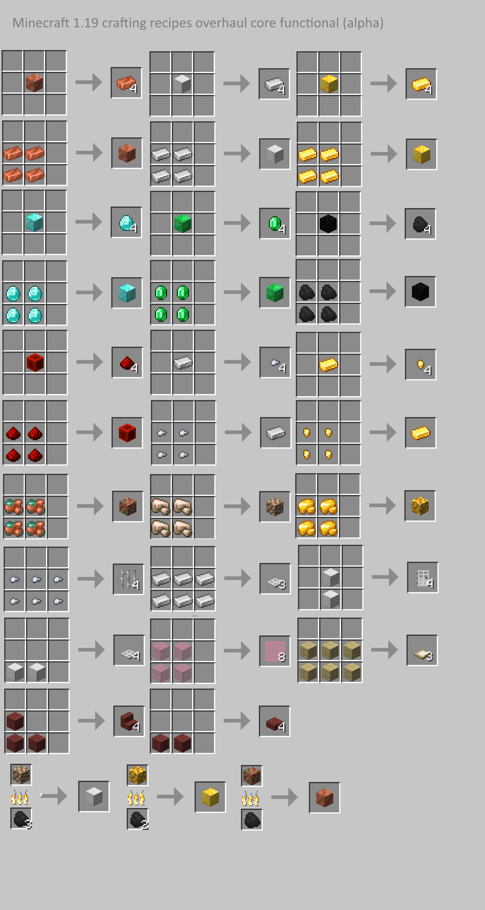

# Crafting Recipes Overhaul

## ℹ️ [Info Center](https://github.com/hydra2s-info) ℹ️ 
## 💬 [Обсуждения/Discussions](https://github.com/hydra2s-info/about/discussions) 💬
## 🐞 [Баг-Репорты/Bug-Tracker](https://github.com/hydra2s-info/about/issues) 🐞

## Datapacks or mod info links

- https://www.planetminecraft.com/data-pack/minecraft-crafting-overhaul/
- https://www.curseforge.com/minecraft/texture-packs/crafting-recipes-overhaul

## Other resources

- https://shorturl.at/exXY4 (my resource packs)
- https://shorturl.at/auvH6 (CO - other assets)
- https://shorturl.at/amqyC (my compiled mods)

## All our forks in https://github.com/hydra2s

- https://github.com/hydra2s/UniversalOres
- https://github.com/hydra2s/minecraft-advancednbttooltip
- https://github.com/hydra2s/AppleSkin 
- https://github.com/hydra2s/Tool-Stats 
- https://github.com/hydra2s/FoodEffectTooltips
- https://github.com/hydra2s/reasonable-sorting
- **https://github.com/hydra2s/nbt-crafting** (for future releases)
- **https://github.com/hydra2s/polymorph** (highly recommended)
- **https://github.com/hydra2s/MC-JSON5** (highly recommended)

## Minecraft recipes mod or datapack (for 2x2 crafts)

### Overview

- Overhaul crafting recipes for 2x2 grid.
- Promised compatibility with Vanilla Tweaks.
- Working on correct balance.
- Modular datapack (split into few).
- More cut copper recipes (mostly, 2x2).
- Doors and trapdoors can be created from wooden logs.

### Spitted to modules

- Core datapack for 1.19 (with packing 2x2).
- Disable default slabs and enable plates.
- Disable default stairs.
- Slabs 2x1 crafts.
- Stairs 2x2 crafts.
- Stairs 3x3 crafts (8 items).
- Pressure plates 3x1.
- Extra copper 2x2 crafts.
- Extra wooden log 2x2 crafts.
- Craft recipes 2x2 for items and tools.
- Unpackable extra.
- Extra better dyeables (most biggest).
- Stairs and slabs to blocks.
- Straight to shapeless items.
- Extras for `Polymorph` mod.
- Vanilla resolve conflicts (dedicated for `Polymorph` compatibility).
- Powder to glass smelting.

### Balance changes

- Packing 4x ingredients instead of 9x (mostly).
- 2x blocks required for 4x slabs (mostly), instead of 3x for 6x slabs (in general, still 1x block per 2x slabs).
- 3x blocks required for 4x stairs (mostly), instead of 6x for 4x stairs (fix injustice).
- 8x glass panes from 4x glass instead of 16x glass panes from 6x glass.
- 3x trapdoors instead of 2x (crafting recipes mostly 3x2).
- Items and tools requires less resources (mostly, items module).

### TODO

- Minecraft 1.20 update content.
- More datapack generation.
- More sorting and organizing.
- Add missed blocks and items
- Add additional features
- Add advancements (currently generated only)

### Problems

These datapacks needs compiler or generator.  
This datapack is balanced for 4x raw ores, NOT for 9x.  
To fix coal fuel balance, needs mod.

### Other authors and contributors

Some datapacks imported from Vanilla Tweaks. 
https://vanillatweaks.net/picker/crafting-tweaks/

### Images

 
 
 
